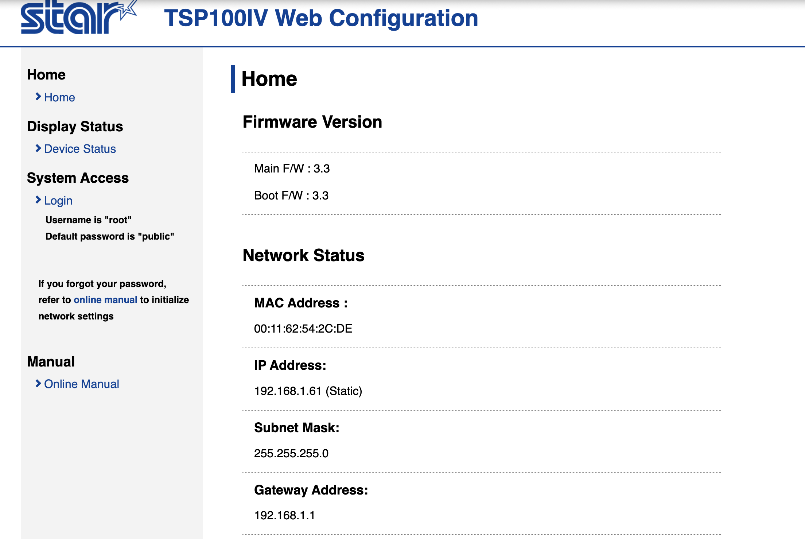
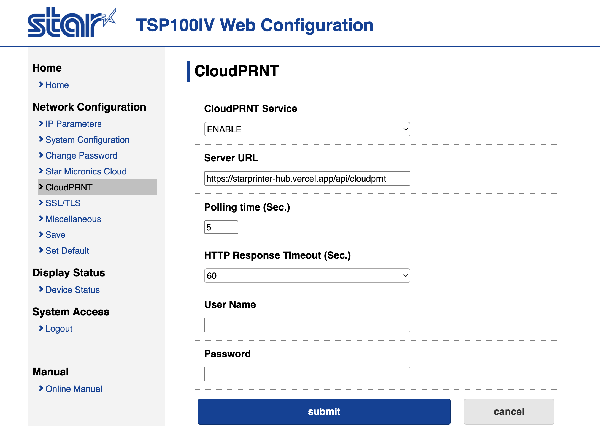
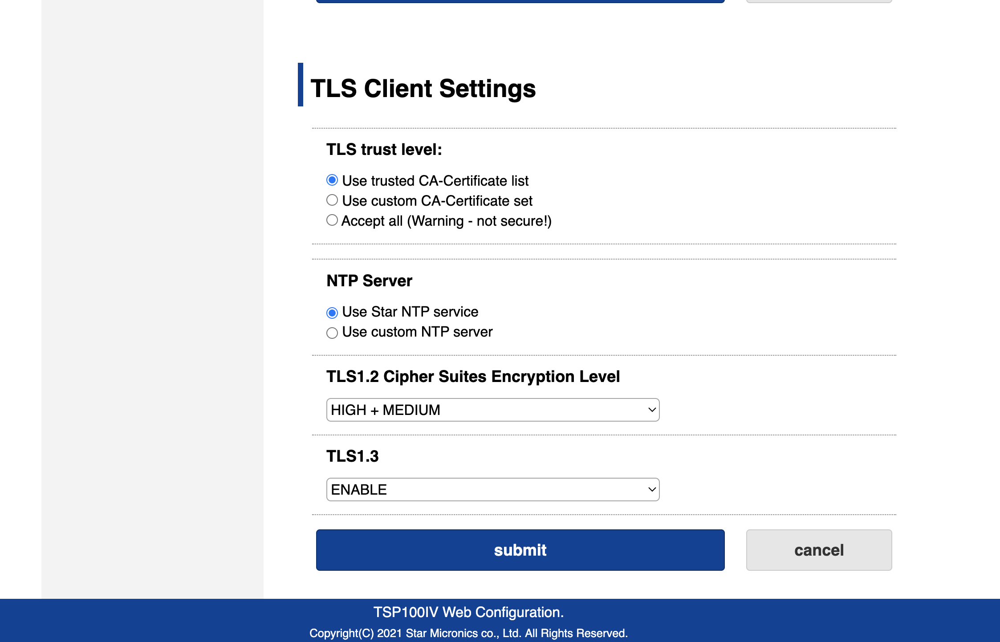

# คู่มือการใช้งาน — Star Printer Hub

ระบบสั่งพิมพ์ใบเสร็จผ่าน Cloud Printer สำหรับ admin / staff ที่ดูแลเครื่องพิมพ์และตรวจสอบงานพิมพ์รายวัน

| รายการ | ค่า |
|---|---|
| URL ระบบ | https://starprinter-hub.vercel.app |
| Admin password | (เก็บใน password manager — ติดต่อ WidelyNext ถ้าลืม) |
| API key สำหรับ integrator | (เก็บใน password manager — ดู Section 7) |

---

## สารบัญ

1. [ภาพรวม](#1-ภาพรวม)
2. [เข้าสู่ระบบ](#2-เข้าสู่ระบบ)
3. [จัดการเครื่องพิมพ์ (Printers)](#3-จัดการเครื่องพิมพ์)
4. [ตั้งค่าเครื่องพิมพ์ Star (CloudPRNT)](#4-ตั้งค่าเครื่องพิมพ์-star)
5. [ทดสอบการพิมพ์](#5-ทดสอบการพิมพ์)
6. [ตรวจสอบงานพิมพ์ (Jobs)](#6-ตรวจสอบงานพิมพ์)
7. [ส่งข้อมูลให้ Integrator (Zoho ฯลฯ)](#7-ส่งข้อมูลให้-integrator)
8. [แก้ปัญหาเบื้องต้น](#8-แก้ปัญหาเบื้องต้น)

---

## 1. ภาพรวม

ระบบทำหน้าที่เป็น **ตัวกลาง** ระหว่างระบบที่สร้างใบเสร็จ (เช่น Zoho Creator) กับเครื่องพิมพ์ Star

```
ระบบ Order   →  Star Printer Hub   →  เครื่องพิมพ์ Star
(Zoho)         (cloud — ของเรา)      (ที่หน้าร้าน)
```

- ระบบ order ส่งคำสั่งพิมพ์มาที่ HUB ผ่าน HTTP API
- เครื่องพิมพ์ Star **ดึงงาน** จาก HUB เองทุก 5 วินาที (CloudPRNT polling)
- ใบเสร็จออกที่หน้าร้านอัตโนมัติ ภายใน 5–10 วินาทีหลังสั่ง

ระบบรองรับเครื่องพิมพ์**สูงสุด 10 เครื่อง** การเพิ่มเครื่องใหม่ทำผ่านหน้า admin ได้เลย

---

## 2. เข้าสู่ระบบ

1. เปิด browser ไปที่ `https://starprinter-hub.vercel.app`
2. ระบบ redirect ไป `/login` อัตโนมัติ
3. กรอก **Admin password** → กด **Sign in**
4. เข้าสู่ Dashboard


หน้า Dashboard แสดง 2 ส่วน
- **Printers** — ตารางเครื่องพิมพ์ทั้งหมด พร้อมสถานะ online/offline + status code ล่าสุด
- **Recent Jobs** — งานพิมพ์ 50 งานล่าสุด

ออกจากระบบ — กดปุ่ม **Sign out** มุมขวาบน

---

## 3. จัดการเครื่องพิมพ์

ไปที่เมนู **Printers**

### เพิ่มเครื่องพิมพ์ใหม่

1. กด **+ Add printer** (ขวาบน)
2. กรอก
   - **Name** — ชื่อที่คุณใช้เรียกเครื่องนี้ เช่น "ครัวสาขาบางนา"
   - **MAC Address** — รูปแบบ `00:11:62:xx:xx:xx` (ดูจาก self-test ของเครื่อง — กดปุ่ม Feed ค้างขณะเปิดเครื่อง)
   - **Branch code** — รหัสสาขา (ถ้ามี เช่น `BKK01`) — optional
   - **Active** — ติ๊กไว้
3. กด **Create printer** → กลับมาหน้า list เห็นเครื่องใหม่ในตาราง

### แก้ไขเครื่องพิมพ์

คลิก **Edit** ในแถวที่ต้องการ → แก้ค่าได้ → **Save changes**

### ปิดใช้ชั่วคราว

แก้ไข → uncheck **Active** → Save จะหยุด poll และไม่รับงานใหม่ (เก็บประวัติงานเดิมไว้)

### ลบเครื่องพิมพ์

คลิก **Delete** ในแถว — ระบบจะกัน**ลบ**ถ้ามี job history (ปุ่ม delete ใช้ได้เฉพาะเครื่องที่ยังไม่เคยพิมพ์อะไร) ถ้าต้องการเลิกใช้ — ใช้ "set inactive" แทน

> สังเกต **● จุดเขียว = online** (เครื่อง poll มาภายใน 60 วินาที), **จุดเทา = idle/offline**, **disabled** = uncheck Active

---

## 4. ตั้งค่าเครื่องพิมพ์ Star

ทำครั้งเดียวต่อเครื่อง — ตั้งให้ printer poll งานจาก HUB ของเรา

### ขั้น 1 — หา IP ของเครื่อง

1. กดปุ่ม **Feed** ค้างไว้แล้วเปิดเครื่อง — ปล่อยเมื่อเริ่มพิมพ์
2. self-test ออกมาเป็นใบ — ดูบรรทัด **IP Address** และ **MAC Address**

จดทั้ง 2 ค่า

### ขั้น 2 — เปิดหน้า Web Configuration

เปิด browser ในเครื่องที่อยู่ network เดียวกับ printer แล้วเข้า

```
http://<IP-ของ-printer>
```

หน้า Home จะขึ้นแบบนี้



login ด้วย
- Username: `root`
- Password: `public` (default — ควรเปลี่ยนภายหลังจากเมนู **Change Password**)

### ขั้น 3 — ตั้ง CloudPRNT URL

เมนูซ้าย → **CloudPRNT**



กรอกตามนี้

| Field | Value |
|---|---|
| **CloudPRNT Service** | `ENABLE` |
| **Server URL** | `https://starprinter-hub.vercel.app/api/cloudprnt` |
| **Polling time** | `5` วินาที (ใบเสร็จออกเร็ว ปกติพอ) |
| **HTTP Response Timeout** | `60` (default) |
| **User Name** | (เว้นว่าง) |
| **Password** | (เว้นว่าง) |

> ระบบไม่ใช้ HTTP Basic auth — ระบุตัวเครื่องด้วย MAC address เท่านั้น

กด **submit**

### ขั้น 4 — ตั้ง TLS (สำหรับ HTTPS)

เมนูซ้าย → **SSL/TLS**



กรอกตามนี้

| Field | Value |
|---|---|
| **TLS trust level** | `Use trusted CA-Certificate list` |
| **NTP Server** | `Use Star NTP service` (จำเป็นสำหรับ TLS — printer ต้องรู้เวลาจริง) |
| **TLS1.2 Cipher Suites** | `HIGH + MEDIUM` |
| **TLS1.3** | `ENABLE` |

กด **submit**

### ขั้น 5 — Save + Reboot

เมนูซ้าย → **Save** → confirm
จากนั้น **ปิด-เปิดเครื่อง** เพื่อให้ค่าใหม่ active

ภายใน 5 วินาทีหลัง reboot — กลับมาที่ Star Printer Hub `/printers` ดู → เครื่องนี้ควรขึ้น **● online** + status `200 OK`

---

## 5. ทดสอบการพิมพ์

ไปเมนู **Test print**

### Form

| Field | คำอธิบาย |
|---|---|
| **Printer** | เลือกเครื่องที่ต้องการ test |
| **Reference ID** | เว้นว่างได้ (auto-generate) — หรือใส่รหัสอ้างอิงของคุณเอง |
| **Star Markup** | คำสั่งจัดหน้าใบเสร็จ — มีตัวอย่าง pre-load ให้แล้ว |

กด **Send to printer** → ระบบ redirect ไปหน้า job detail → ภายใน 5 วินาที printer พิมพ์

### Markup tags ที่ใช้บ่อย

| Tag | ใช้ทำ |
|---|---|
| `[align: centre]` / `[align: left]` / `[align: right]` | จัดข้อความ |
| `[mag: w 2; h 2]ข้อความ[mag]` | ขยายขนาด 1×–6× |
| `[bold]ตัวหนา[/bold]` | หนา |
| `[image: url https://...; width 60%]` | รูปจาก URL |
| `[barcode: type code39; data 12345; height 15mm; hri]` | barcode |
| `[qrcode: data ...]` | QR code |
| `[column: left: รายการ; right: 100.00]` | จัด columns |
| `[feed: lines 2]` | feed กระดาษ 2 บรรทัด |
| `[cut]` | ตัดกระดาษ — **ต้องใส่เองทุกครั้ง** |

ดูสเปกเต็ม: https://cloudprnt.net/CloudPRNTSDK/Documentation/articles/markup/markupintro.html

---

## 6. ตรวจสอบงานพิมพ์

หน้า Dashboard (`/`) — ตาราง **Recent Jobs (last 50)** แสดง

| Column | ความหมาย |
|---|---|
| Time | เวลาที่ระบบรับงาน |
| Reference | reference id ฝั่งผู้ส่ง (ถ้ามี) |
| Branch | สาขาของ printer |
| Printer | ชื่อเครื่อง |
| Status | `pending` / `printing` / `done` / `failed` |
| view | คลิกดูรายละเอียด |

### Status meanings

| Badge | ความหมาย |
|---|---|
| **pending** | รออยู่ในคิว — printer ยังไม่ poll |
| **printing** | printer ดึงงานไปแล้ว กำลังพิมพ์ |
| **done** | พิมพ์สำเร็จ printer confirm กลับ |
| **failed** | ผิดพลาด — ดู error message ในหน้า detail |

### หน้ารายละเอียดงาน `/jobs/[id]`

แสดง
- Job ID (UUID ระบบสร้าง)
- Reference (ถ้ามี)
- Status + Created/Printed timestamps
- Printer + Branch
- Error message (ถ้า failed)
- Star Markup ดิบที่ submit เข้ามา

### ปุ่มจัดการ

- **Retry** — กด re-queue งานที่ failed/printing ใหม่ (กลับเป็น pending)
- **Mark done** — manual ปิดงานที่ค้างอยู่ (ใช้กรณี printer พิมพ์แล้วแต่ DELETE-ack หาย)

---

## 7. ส่งข้อมูลให้ integrator

ระบบรับ print job ผ่าน HTTP API — Zoho Creator, Make, n8n, custom backend หรืออะไรก็ได้ที่ยิง HTTP request ได้

### Endpoint

```
POST https://starprinter-hub.vercel.app/api/print/jobs
```

Headers
```
x-api-key: <api-key-ที่เราให้>
Content-Type: application/json
```

Body
```json
{
  "printerId": "725691e6-...",
  "referenceId": "ORD-001",
  "markup": "[align: centre]ใบเสร็จ\n[cut]"
}
```

### ดู API spec ในระบบ

หน้า **Test print** → ส่วน **API spec** (ด้านล่างฟอร์ม) — มี curl ตัวอย่างพร้อม `printerId` ของเครื่องตัวแรกใน list ให้ — copy ส่งให้ทีม integrator ได้เลย

### ดู printerId ที่ต้องส่งให้ integrator

หน้า **Printers** → ค่า MAC แสดงในตาราง แต่ Zoho ต้องการ **printerId (UUID)**

ดู printerId ได้ 2 ทาง
- คลิก **Edit** ที่เครื่อง → ดู URL `/printers/<UUID>/edit` — UUID อยู่ใน URL
- หรือเปิด Drizzle Studio (technical — ติดต่อ WidelyNext)

### ส่ง API key ให้ทีม integrator

⚠️ **ห้าม** ส่งทาง email/Line/Teams ที่ไม่เข้ารหัส
ใช้ช่องทางที่ปลอดภัย เช่น
- Password manager shared vault (1Password, Bitwarden) — แนะนำ
- https://onetimesecret.com — link หมดอายุครั้งเดียว
- ปิดผนึกใส่ envelope ส่งมือ

ดูเอกสารสเปกเต็มที่ `_documents/API.md`

---

## 8. แก้ปัญหาเบื้องต้น

| อาการ | สาเหตุที่เป็นไปได้ | วิธีแก้ |
|---|---|---|
| Printer ขึ้น **offline** ในหน้าแรก | ไฟดับ / สาย LAN หลุด / Wi-Fi หลุด / CloudPRNT URL ผิด | (1) เช็คไฟ + LAN (2) ใน printer web config ดู Server URL ตรงไหม (3) ลอง reboot |
| Order เข้าระบบ status `failed` พร้อม "Printer not found" | `printerId` ใน request ไม่ตรงกับเครื่องที่มีในระบบ หรือ printer ถูก uncheck Active | ตรวจ `printerId` ใน request หรือเปิด Active กลับมา |
| Status `failed` พร้อม "printer code: 420" | ฝา printer เปิด | ปิดฝา → กด **Retry** ในหน้า job |
| Status `failed` พร้อม "printer code: 410" | กระดาษหมด | ใส่กระดาษใหม่ → Retry |
| Status `failed` พร้อม "image fetch ..." | URL ของรูปใน markup ดึงไม่ได้ | ตรวจ URL accessible จาก internet (ลอง curl) — ห้ามเป็น URL ที่ login เข้าไม่ได้ |
| Status ค้าง `printing` นาน | DELETE-ack จาก printer หาย / printer ค้าง | รอ 10 นาที — ระบบมี cron auto-mark failed; หรือกด **Mark done** ใน job detail |
| Login ไม่ผ่าน | จำ password ผิด | ติดต่อ WidelyNext เพื่อ rotate ใหม่ |
| ใบเสร็จออก แต่ภาษาไทยเป็นต่างดาว | ไม่น่าเกิด — ระบบใช้ cputil convert ให้ตรง code page อยู่แล้ว | ส่ง screenshot ใบเสร็จ + jobId ให้ WidelyNext |
| External API ยิงมาแล้ว 401 | api-key ผิด หรือ key ถูก rotate | ตรวจค่า / ขอ key ใหม่จาก WidelyNext |

### ดู log/รายละเอียดเพิ่ม

ทุกงานที่ fail มี **error message** ในหน้า `/jobs/[id]` คลิก row ใน Recent Jobs จะเข้าหน้านี้

ปัญหาที่ดีบักไม่ออก — copy **Job ID** + screenshot หน้า detail ส่งให้ WidelyNext

---

## ติดต่อ

- ทีมเทคนิค: WidelyNext Co., Ltd.
- คู่มือ operations (deploy, key rotation, backup): `_documents/Runbook.md`
- API spec รายละเอียด: `_documents/API.md`
